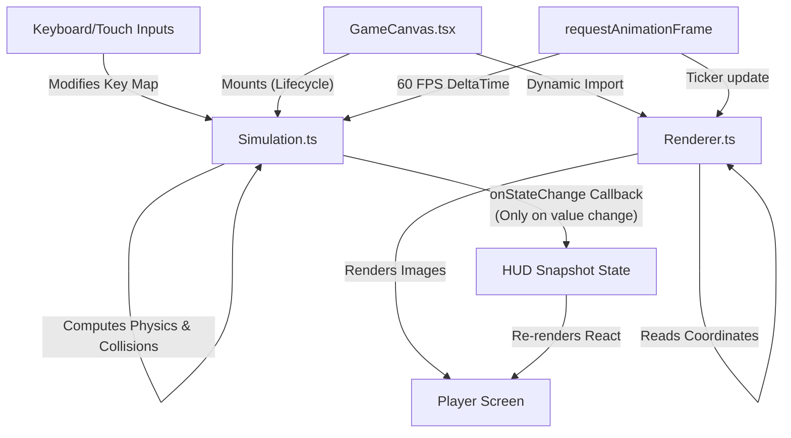
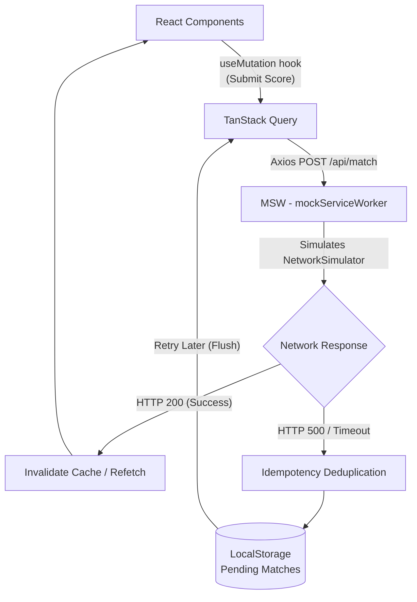
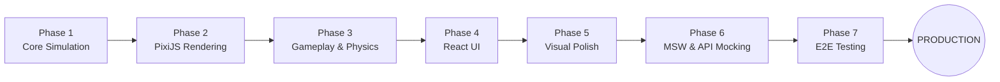

# Pirate Battle - Architecture and Design Decisions

## Runtime Boundaries

- `tsconfig.app.json` and `tsconfig.node.json` enable TypeScript `strict` mode; `npm run typecheck` checks both project references.
- `src/game/Simulation.ts` owns the active match state: player, enemies, projectiles, islands, cooldowns, score, health, and remaining time. It implements movement, spawning, collisions, damage, and termination.
- `src/game/Renderer.ts` owns the PixiJS application and mirrors simulation entities into sprites and graphics. It loads textures through `PIXI.Assets`, updates the display from the Pixi ticker, and creates short-lived explosion animations when enemies disappear.
- React owns navigation, menus, configuration, HUD snapshots, pause UI, and the lifecycle of a match. `GameCanvas.tsx` creates and destroys the simulation and renderer, forwards game-over results, and displays asset loading progress or errors.

The simulation is decoupled from PixiJS and React, but it is browser-oriented: it uses `window`, `requestAnimationFrame`, keyboard events, viewport dimensions, and a `window.__SIMULATION__` test hook. It should not be described as a platform-independent or pure TypeScript module.

## Simulation and Rendering

The simulation uses `requestAnimationFrame` and derives a delta in seconds from each frame. A frame delta is capped at 0.1 seconds. Movement, cooldowns, timers, enemy spawning, and projectile motion use that delta. While paused, the loop continues scheduling frames without updating game state; resuming resets the time origin and clears held inputs.

Playwright installs a fixed gameplay seed in each fresh page context. `Simulation` uses a seeded PRNG for enemy spawn positions and type selection only when this test configuration is present; ordinary sessions continue to use `Math.random()`. Tests may enable `manualClock` and call `advanceTestTime(ms)`, which advances the real simulation update in steps capped at 100 ms while the render loop stays active. This makes test time deterministic without bypassing inputs, collision logic, or rendering.

The PixiJS ticker reads simulation state and updates display objects. React receives a compact HUD snapshot only when the displayed time, health, or score changes, rather than receiving every position update. The player and enemy health bars, projectiles, and explosions are PixiJS objects.

## Gameplay Rules

Player and enemy movement is clamped to the viewport and resolved against island circles. Projectiles advance by their configured speed and direction and are removed on expiration, arena exit, island impact, or a single successful hit. Front cannons create one projectile; each broadside creates three and uses its own cooldown. Defeating an enemy with a player projectile awards one point. Chaser collision damages the player and removes the Chaser without awarding a point.

Enemy type ratios are normalized before selection. When both ratios are positive, the first two spawns guarantee one Chaser and one Shooter; subsequent spawns use the configured distribution. Spawn searches are bounded and skip candidates that are too close to the player or islands. Shooter firing is limited to the configured range. When the window is resized, `Simulation` recomputes the island positions from the new viewport size and the renderer follows them; ships are re-clamped to the arena by the next collision pass.

## Configuration and Persistence

`src/config/GameConfig.ts` defines defaults and option limits. The Options screen persists session duration and spawn interval in local storage. `Simulation` clones the configuration at construction, so an active match uses a snapshot. The last completed match and pending match submissions are stored locally; abandoning an active match does not invoke the completion callback.

## Assets and Resource Lifecycle

`GameCanvas` dynamically imports the Pixi renderer only after entering combat. `Renderer.init()` initializes PixiJS, attaches its canvas, loads the water, ship, HUD, and explosion textures, and reports loading progress. Loaded texture references are reused for new entities within the renderer instance. `GameCanvas` cleanup stops and destroys the simulation, removes its keyboard listeners, destroys the Pixi application, and clears component references. Renderer teardown is idempotent, retains PixiJS global resource caches, and handles asynchronous initialization cancellation. Failed asset loading destroys the renderer before presenting retry UI. The app is mounted under React `StrictMode`.

The PixiJS asset cache is global. This implementation does not explicitly unload every cached URL after a match, so renderer destruction should not be interpreted as proof that all shared cached textures have been evicted from memory.

## Ranking and Match History

`src/api/client.ts` defines typed Axios requests against `/api/ranking`, `/api/history`, and `/api/match`. `src/api/queries.ts` uses TanStack Query for caching, retries, refetching, and invalidation. Successful match registration invalidates ranking and history queries. Failed submissions are deduplicated by match ID in a local pending queue and can be flushed later.

MSW handlers in `src/mocks/handlers.ts` implement the API in the browser. They combine fixtures with locally stored submitted matches, filter ranking entries by session configuration, sort deterministically, and paginate results. Repeated registration with the same match ID returns the existing record. `NetworkSimulator` selects a scenario persisted in local storage; its reset action clears the scenario, mock records, last result, and pending queue, then reloads the page.

MSW's service worker retains its root scope so its client can intercept API requests. Its fetch listener explicitly bypasses document navigations, leaving app-shell requests to the browser and preventing the root URL from being reported as an unhandled API request. The worker remains generated by MSW; after regenerating it on an MSW upgrade, reapply and test this small navigation bypass.

MSW is started with `onUnhandledRequest: 'bypass'` (`src/mocks/browser.ts`). Only `/api/*` requests have handlers; any other request, such as background requests added by hosting tooling like the Vercel toolbar, is passed through to the network without the `[MSW] Warning: intercepted a request without a matching request handler` console message. This has not been re-checked in the DevTools console of a deployed Vercel preview, and a passthrough request that the browser itself rejects would still be reported by the browser rather than by MSW.

Available network scenarios include reproducible variable latency, history returning before delayed ranking, global HTTP 400/500 errors, ranking-only and history-only failures, network errors, empty lists, and delayed match registration that can recover idempotently after a client timeout.

## API Contracts, Caching, and Stale Responses

Types live in `src/types/match.ts`; requests are made by `matchApi` in `src/api/client.ts` (Axios, base URL `/api`, 5 s timeout).

| Request | Parameters | Success response |
| --- | --- | --- |
| `GET /api/ranking` | `page` (default 1), `limit` (default 10, clamped to 1-50; the UI uses 5), `sessionTime` (default 60), `spawnInterval` (default 3.0) | `PaginatedResponse<RankingEntry>` |
| `GET /api/history` | `page`, `limit` (same rules), `playerId` (default `player_me`) | `PaginatedResponse<MatchRecord>`, newest first |
| `POST /api/match` | body: `MatchRecord` | `201` with the stored record; `200` with the existing record if the ID is already stored; `400` if the ID is missing |

`PaginatedResponse<T>` is `{ items, total, page, limit, totalPages }`. `MatchRecord` holds `id`, `playerId`, `playerName`, `date` (ISO string), `score`, `duration` (effective seconds), `reason` (`TerminationReason`) and the `config` snapshot. `RankingEntry` adds `rank` and reduces the configuration to `sessionTime` and `spawnInterval`. Ranking only compares matches with the same two configuration values and orders them by score (descending), then shorter duration, earlier date and finally ID, so the order is deterministic. Fixture opponents (`src/mocks/fixtures.ts`) all use the default configuration, so other configurations start with only the player's own matches. Scenario failures return `{ message }` with status 400 or 500, or a network error.

**Caching.** Queries use `staleTime: 5000`, `refetchOnMount: 'always'`, `refetchOnWindowFocus: true` and `retry: 2`; mutations are not retried automatically. Query keys are `['ranking', params]` and `['history', params]`, so each page and configuration has its own cache entry. A successful `useRecordMatch` invalidates the `ranking` and `history` key families, which refetches the views that are mounted.

**Stale responses.** A late response cannot overwrite newer data because results are stored per query key and each component renders the entry for its current key; a delayed page-1 response only updates the page-1 entry. For repeated fetches of the same key (for example after an invalidation), TanStack Query either shares the in-flight request when the query has no data yet or cancels the older fetch and discards its result when data already exists. The queries do not pass an `AbortSignal` to Axios, so a superseded HTTP request still completes; only its result is ignored. The `out_of_order` scenario and its E2E test cover ranking and history arriving in reverse order; there is no dedicated same-key race test.

**Pending registrations.** If `POST /api/match` fails or times out, `useRecordMatch` stores the record in `pirate_pending_matches_queue` (local storage, deduplicated by match ID) and rethrows. The queue survives refresh and is retried from the Retry action in `ResultsModal` or **Retry Upload** in `MatchHistory` (`useFlushPendingMatches`). The match ID is generated by the client, and the mock endpoint returns the existing record when it receives an ID it has already stored, so a retry after a timeout does not create a second record. Starting a new match never waits on this queue.

## Balancing Decisions

All balance values are in `DEFAULT_CONFIG` (`src/config/GameConfig.ts`); the Options screen only exposes session duration (default 60 s) and spawn interval (default 3.0 s). `Simulation` reads everything else from its configuration snapshot, so retuning does not require changes to the game rules.

| Area | Values | Consequence |
| --- | --- | --- |
| Player | 300 health, speed 200, turn speed 2.5 rad/s, damage 1 | Faster than a Chaser (120) and much faster than a Shooter (70). |
| Player weapons | Front cannon: 1 projectile, 0.5 s cooldown. Broadside: 3 projectiles, 1.0 s cooldown. Projectile speed 400, lifetime 2 s | Projectiles travel at most 800 px; broadsides trade rate of fire for a wider spread. |
| Chaser | Health 2, speed 120, contact damage 10, contact radius 40 | Two hits to destroy; about 30 contacts to defeat the player. |
| Shooter | Health 3, speed 70, range 250, cooldown 2.0 s, projectile speed 200, damage 5 | Three hits to destroy; its projectiles travel at most 400 px, shorter than the player's. |
| Spawning | Equal Chaser/Shooter ratios, first two spawns guaranteed one of each, at most 50 active enemies | Both enemy types appear in every standard match. |

These numbers are starting points for a playable standard match and are not backed by a balancing study or telemetry.

## Accessible Dialogs and Mobile Input

`src/hooks/useDialogFocus.ts` focuses the first relevant control, wraps Tab/Shift+Tab, redirects focus that escapes a modal, supports contextual Escape actions, and restores the previous focus target on close. Touch controls use pointer capture and release their input on pointer-up, cancellation, or capture loss. The MSW trigger moves above the touch controls on narrow screens.

## Build Loading

The Pixi renderer is a separate dynamic chunk and is imported when gameplay starts rather than with the main menu. A production build on 2026-10-07 reported a 757.60 kB (265.02 kB gzip) entry chunk and a 262.70 kB (76.44 kB gzip) renderer chunk. This is bundle-size evidence only; it does not measure browser download timing, frame rate, or memory.

## Known Limitations

- `Simulation` is decoupled from PixiJS and React but not from the browser: it reads `window` sizes, uses `requestAnimationFrame` and keyboard listeners, and exposes `window.__SIMULATION__`, so it cannot run or be unit-tested outside a browser.
- PixiJS textures stay in the global asset cache after a match, and GPU memory was not measured; the profiling only covers the JavaScript heap.
- Profiling was run on one desktop machine at 1280x720; mobile devices and the GPU were not profiled (see `PERFORMANCE.md`).
- Ship-to-ship collision is O(n²); the 50-enemy cap keeps it cheap, and spatial partitioning would be needed to scale well beyond that.
- `TerminationReason` includes `victory` and the results screen handles it, but the simulation only produces `defeat` and `time_out`.
- Ranking fixtures exist only for the default configuration, and the single local player is always `player_me`.
- Visual baselines are per operating system (Windows and Linux; no macOS files).
- Switching a non-touch device to touch mode in the middle of a session does not add the mobile controls.
- Verify the public deployment with the deployed-site E2E command in `README.md` after each release; it has only been checked from one machine.

## Development Workflow

The project was executed following an iterative, layered pipeline to ensure the engine and the UI were fully decoupled from day one.

